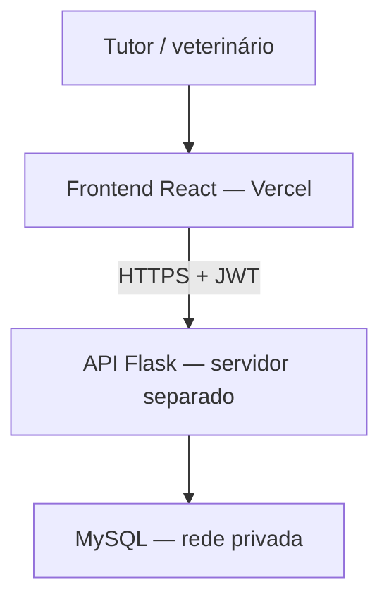

# Projeto veterinário — PI II

Frontend React 19, Vite e Tailwind para tutores e veterinários. Mantém agenda, pets, pacientes e configurações do PI I e adiciona procedimentos e valores por atendimento, resumo financeiro por dia/mês/ano e consulta de valores pelo tutor.

## Executar

Node.js 22 e npm. O backend Flask/MySQL é um projeto separado e **não está incluído neste repositório**.

```bash
npm ci
cp .env.example .env
npm run dev
```

Configure `VITE_API_URL` com a URL base da API, sem barra final. Login, cadastro e persistência exigem servidor disponível. Não existe login fictício nem fallback de produção para dados simulados. Variáveis `VITE_*` ficam públicas no bundle: nunca coloque senhas ou chaves privadas nelas.

## Finanças

- Veterinário cadastra, altera e inativa procedimentos; define preço de referência e custo de materiais.
- No registro clínico, seleciona procedimentos, quantidades e preços praticados.
- Consulta valores por intervalo e agrupamento diário, mensal ou anual.
- Tutor consulta apenas os valores de seus atendimentos concluídos.

O frontend envia valores decimais com duas casas. O servidor deve calcular totais, controlar autorização e manter cópias históricas dos preços. Resumo de serviços não é lucro nem confirmação de pagamento. Os novos endpoints estão especificados em [docs/API_FINANCEIRA.md](docs/API_FINANCEIRA.md); implementar e validar no Flask antes de considerar o módulo integrado.

## Qualidade

```bash
npm run quality:check
npm run test:coverage
npx playwright install --with-deps chromium
npm run test:e2e
```

Vitest verifica HTTP, valores monetários, CRUD e confirmações assíncronas. Playwright verifica fluxos financeiros, falhas, foco, teclado, navegação móvel e acessibilidade com axe. A API é interceptada **somente nos testes**. Esses testes não demonstram persistência, segurança ou compatibilidade do backend real. Não há requisito de cobertura de 100%. CI executa lint, testes, build e navegador em pushes e pull requests.

Antes de entregar o PI, validar com servidor real: autorização entre tutores/veterinários, preços históricos, totais em Decimal, conflitos simultâneos, persistência após atualizar página e desempenho. Registrar consentimentos, feedback do parceiro, resultados e demonstração nas entregas acadêmicas; o código não substitui essas evidências.

## Publicação e nuvem

Frontend pode ser publicado na Vercel com build `npm run build`, saída `dist` e variável `VITE_API_URL` apontando para API HTTPS. `vercel.json` permite acesso direto às rotas React. Backend deve permitir CORS somente das origens necessárias e validar JWT em cada endpoint. Nuvem usada pelo frontend não hospeda automaticamente Flask nem MySQL.



Não efetue deploy com endpoint local. Documente URL, provedor, configuração, diagrama e evidências do serviço em nuvem no relatório do PI. [IMPLEMENTATION_PLAN.md](IMPLEMENTATION_PLAN.md) contém sequência, diário e pendências.
